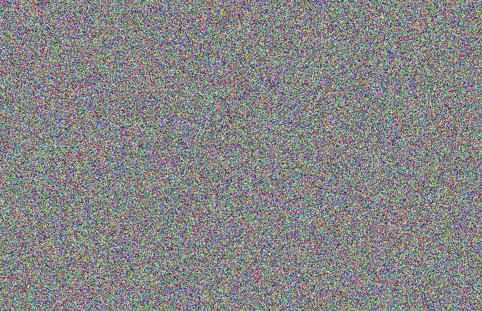

# Chaos-Crypt

This repo contains **ccrypt**, a Java implementation of the private key
cryptosystem described in [Coupled Map Networks as Communication Schemes](http://arxiv.org/abs/nlin/0201042)(1). Super simple, and presumably strong
until shown otherwise, they call it *Text Dependent Encryption*.

If you want to try it out, you can go to folder ccrypt-dist and run
the *ccrypt* shell script.

To generate a key into the current folder

    $ sh ccrypt g key.tde

To encrypt the ccrypt script into file ccrypt.enc

    $ sh ccrypt e key.tde ccrypt ccrypt.enc

To decrypt it run

    $ sh ccrypt d key.tde ccrypt.enc ccrypt.dec

Sample cipher-text can be found in folder res/cipher-text. The corresponding
private keys can be found in folder res/keys. You'll be happy reading the
plain-text if you are a fan of Lewis Carroll.

### Visual

Chaotic cryptography takes advantage of the high sensitivity to initial
conditions exhibited by certain dynamical systems. The content of following
image was encrypted using the Text Dependent Encryption

This is what happens when we try to recover the image using a slightly
tampered key. Text Dependent Encryption keys are 576-bit long, here one single
bit of the key was flipped.

### To anyone who might want to use **ccrypt** for anything other than mere intellectual curiosity

- Use it for a good purpose.
- I don't know about any thorough study on the strength of
the cryptosystem, so I don't know for sure how safe it is.
- Last but not least, some caveats:
    - The generated ciphertext is twice as large as the plaintext.
    - It seems to me there is no guarantee that *any* piece of
    plaintext can be encrypted with the **ccrypt** implementation (anything
    that has been encrypted can be brought back, but not *everything* can be
    encrypted). Theoretically, it is possible. But then again,
    theoretically, there would be no bound to the size the ciphertext
    might have.
    - The following is true of the method: *decrypt(encrypt(M)) = M*.
    But the following is not necessarily true: *encrypt(decrypt(M)) = M*.
    - The method is relatively slow.

Please report any bugs to: mario.rincon.nigro@gmail.com

## References

(1) Garcia P, et al. *Phys Rev E Stat Nonlin Soft Matter Phys*. 2002 Apr;65(4 Pt 2A):045201. Epub 2002 Mar 28.
